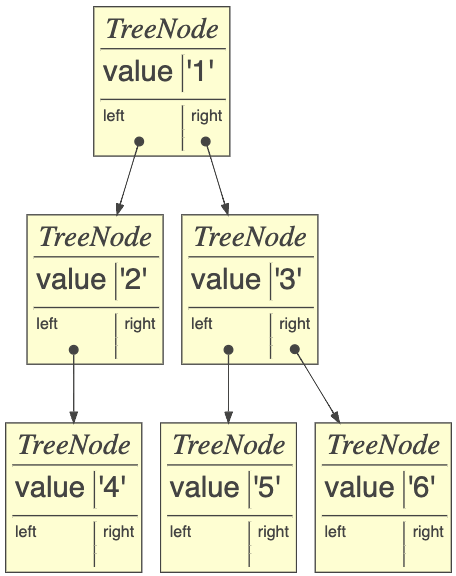

# Decision Tree
[](https://opensource.org/licenses/MIT)

This repository contains a Python implementation of a decision tree algorithm. The decision tree is a popular machine learning algorithm used for both classification and regression tasks. This implementation provides classes for building decision trees for classification and regression purposes.

## Decision Tree Overview

A decision tree is a hierarchical structure that makes predictions by recursively partitioning the input data based on a set of splitting rules. At each node of the tree, a decision is made based on the value of a specific feature. The tree branches out into multiple child nodes based on the possible feature values, leading to a series of decision nodes and leaf nodes.<br><br>

The decision nodes compare feature values against a splitting threshold, while the leaf nodes represent the final predictions. In classification tasks, leaf nodes typically predict the most common class in the corresponding subset of data, while in regression tasks, leaf nodes predict the average value of the target variable.

## Files

The `dtree.py` file in this repository contains the implementation of the decision tree algorithm. It includes the following classes:

- `DecisionNode`: Represents a decision node in the decision tree. It stores the column index of the feature to split on, the splitting threshold, and references to the left and right child nodes.
- `LeafNode`: Represents a leaf node in the decision tree. It stores the target values and the prediction based on those values.
- `DecisionTree621`: Base class for decision tree models. It provides methods for fitting the tree to the data and making predictions.
- `RegressionTree621`: Subclass of `DecisionTree621` specialized for regression tasks. It uses the MSE as the loss function.
- `ClassifierTree621`: Subclass of `DecisionTree621` specialized for classification tasks. It uses the Gini impurity as the loss function.

## Usage

To use the decision tree implementation, follow these steps:

1. Import the necessary libraries:

```python
import numpy as np
from scipy import stats
from sklearn.metrics import r2_score, accuracy_score
```

2. Import the decision tree classes from `dtree.py`:

```python
from dtree import DecisionTree621, RegressionTree621, ClassifierTree621
```

3. Create an instance of the desired decision tree class:

```python
# For regression tasks
reg_tree = RegressionTree621(min_samples_leaf=1)

# For classification tasks
clf_tree = ClassifierTree621(min_samples_leaf=1)
```

4. Fit the decision tree to your training data:

```python
reg_tree.fit(X_train, y_train)  # X_train is the feature matrix, y_train is the target values

clf_tree.fit(X_train, y_train)  # X_train is the feature matrix, y_train is the class labels
```

5. Make predictions using the trained decision tree:

```python
reg_predictions = reg_tree.predict(X_test)  # X_test is the feature matrix for test data

clf_predictions = clf_tree.predict(X_test)  # X_test is the feature matrix for test data
```

6. Evaluate the performance of the decision tree:

```python
# For regression tasks, the score is the R^2 score
reg_score = reg_tree.score(X_test, y_test)  # X_test is the feature matrix, y_test is the true target values

# For classification tasks, the score is the accuracy
clf_score = clf_tree.score(X_test, y_test)  # X_test is the feature matrix, y_test is the true class labels
```

## Example
Here is an example of how to use `ClassifierTree621` with sample data and the comparison with scikit-learn `DecisionTreeClassifier`:

```python
from sklearn.datasets import load_iris
from sklearn.tree import DecisionTreeRegressor, DecisionTreeClassifier
from sklearn.model_selection import train_test_split

from dtree import *

# Number of trials for evaluation
ntrials = 5

# Minimum number of samples required to be at a leaf node
min_samples_leaf = 1

# Load the Iris dataset
X, y = load_iris(return_X_y=True)

# Lists to store scores
scores = []
sklearn_scores = []

# Perform the trials
for i in range(ntrials):
    # Split the data into training and test sets
    X_train, X_test, y_train, y_test = train_test_split(X, y, test_size=0.20)

    # Create an instance of the ClassifierTree621 class and fit it to training data
    dt = ClassifierTree621(min_samples_leaf=min_samples_leaf)
    dt.fit(X_train, y_train)
        
    # Evaluate the ClassifierTree621 decision tree
    score = dt.score(X_test, y_test)
    scores.append(score)

    # Create and fit the sklearn decision tree
    sklearn_dt = DecisionTreeClassifier(min_samples_leaf=min_samples_leaf, max_features=1.0)
    sklearn_dt.fit(X_train, y_train)
    
    # Evaluate the sklearn decision tree
    sklearn_score = sklearn_dt.score(X_test, y_test)
    sklearn_scores.append(sklearn_score)

# Calculate and print the mean accuracy scores
print(f"621 accuracy score: {np.mean(scores):.2f}")                # Output: "621 accuracy score: 0.96"
print(f"sklearn accuracy score: {np.mean(sklearn_scores):.2f}")    # Output: "sklearn accuracy score: 0.96"
```

The example performs a comparative evaluation between `ClassifierTree621` and the decision tree implementation from scikit-learn (`DecisionTreeClassifier`) on the Iris dataset. It splits the dataset into training and test sets, fits both decision tree models to the training data, and evaluates their accuracy scores on the test data. 

The accuracy scores for both models are very close, with both achieving an accuracy of 0.96 on average. It indicates that `ClassifierTree621` is able to learn and make predictions with a similar level of accuracy as the scikit-learn model.

## License

This project is licensed under the MIT License. See the [LICENSE](LICENSE) file for details.

## Acknowledgments

The initial codebase and project structure is adapted from the MSDS 621 course materials provided by the University of San Francisco (USFCA-MSDS). Special thanks to the course instructors for the inspiration.
